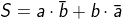
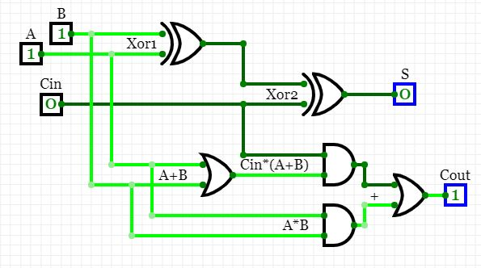

# Lab 4: Binary adder

## Preparation

### Half-adder

| **B** | **A** | **Carry (half)** | **S (half)** |
| :-: | :-: | :-: | :-: |
| 0 | 0 | 0 | 0 |
| 0 | 1 | 0 | 1 |
| 1 | 0 | 0 | 1 |
| 1 | 1 | 1 | 0 |

### Full-adder

| **Cin** | **B** | **A** | **Cout (full)** | **S (full)** |
| :-: | :-: | :-: | :-: | :-: |
| 0 | 0 | 0 | 0 | 0 |
| 0 | 0 | 1 | 0 | 1 |
| 0 | 1 | 0 | 0 | 1 |
| 0 | 1 | 1 | 1 | 0 |
| 1 | 0 | 0 | 0 | 1 |
| 1 | 0 | 1 | 1 | 0 |
| 1 | 1 | 0 | 1 | 0 |
| 1 | 1 | 1 | 1 | 1 |

### Schematic

