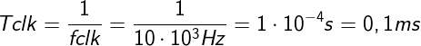

# Lab 5:Binary counter
## Preparation:

| **Time** | **Number of periods** | **Number of periods in binary** | **Number of periods in hexa** |
| :-: | :-: | :-: | :-: |
| 10 ms | 100 | 0b0110 0100 | 0x15 64 |
| 250 ms | 2500 | 0b1001 1100 0100 | 0x15 9C4 |
| 500 ms | 5000 | 0b0001 0011 1000 1000 | 0x15 1388 |
| 1 s | 10000 | 0b0010 0111 0001 0000 | 0x15 2710 |