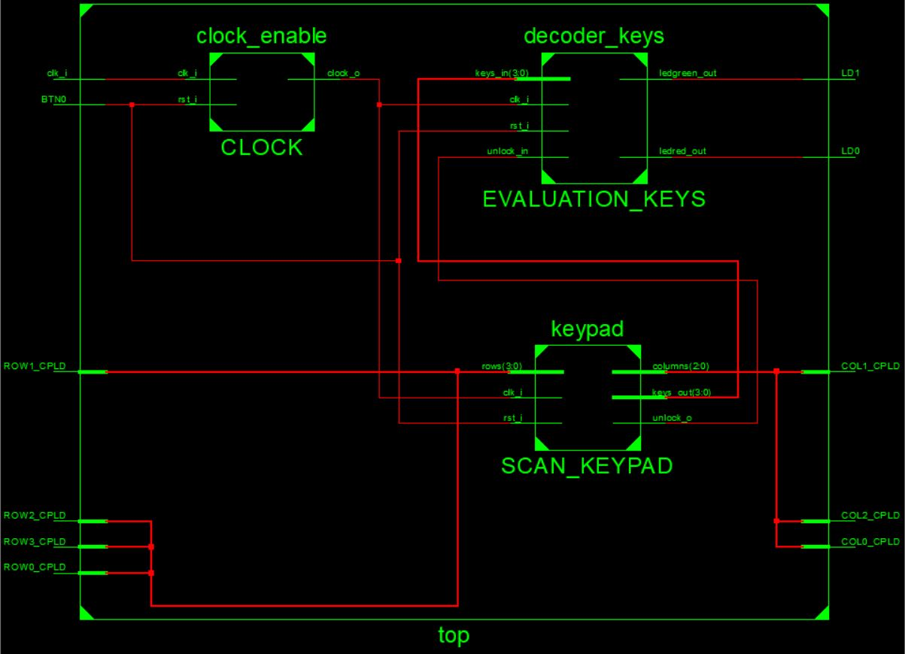
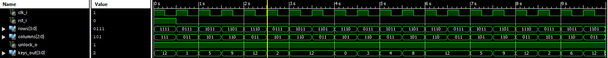
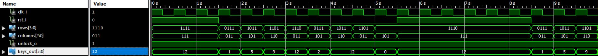
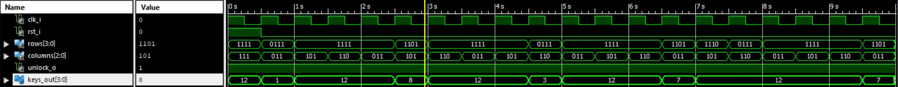
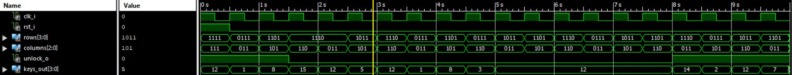
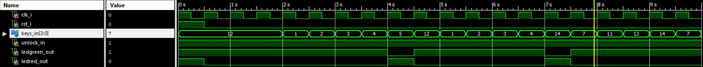
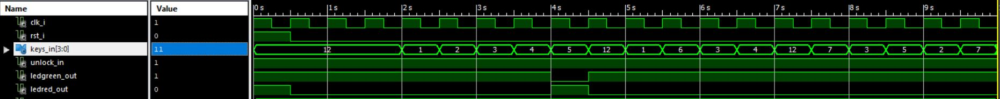
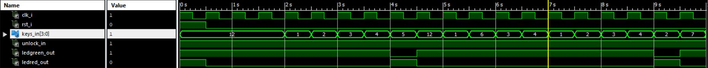
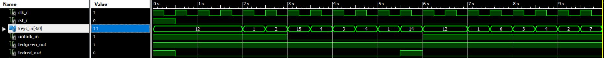
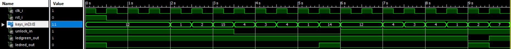

### Projekt: Zámek s maticovou klávesnicí
## Popis
Mým projektem byl zámek se zadáváním na maticové klávesnici 4x3. Tato maticová klávesnice je samostatný přídavný komponent, který musíme připojit pomocí J-konektoru a museli jsme tudíž pro něj vymyslet proces zjištění stisku klávesy. Na výstup celého projektu jsem si pak dal dvě LED diody, kde jedna signalizovala zamknuto a druhá odemknuto. Jako hodinový signál jsme použili 10kHz, který jsme si pak pomocí obvodu clock_enablu převedli na 2kHz a měli tak všechny dílčí obvody synchronní a zároveň jsem bral v úvahu dobu trvání stisku klávesy 500ms, jinak bych měl totiž v mém obvodu problém s tím, že by jeden stisk klávesy odpovídal v programu dvoum stiskům, takto jsem to minimálně eliminoval. Našel jsem si na to hodně málo času, tudíž věřím že by to šlo napsat o mnohem lépe a bude to mít mé mouchy, ale hlavní účel jsem odsimuloval.

# 1. Clock_enable
Obvod jsme popsali v odstavci výše, zkrátka máme jistotu synchronizace obvodů a máme upravenou frekvenci na 2kHz, což odpovídá periodě stisku 500ms a můžeme takto použít jeden ze tří kmitočtů dostupných na desce.
# 2. Keypad - scannování kláves
Scan klávesnice se dělá tak, že já tedy nastavoval sloupce na výstup a určoval jsem si jejich logickou úroveň, na druhou stranu řádky jako input, takže když někdo stiskl jakoukoliv klávesu, na řádku jsem to poznal. Postupně jsem zapl první sloupec, otestoval řádky, zda někde není logická úroveň Low, ta signalizuje sepnuté tlačítko, druhý sloupec, třetí a pořád dokola.

Zároveň jsem to celé limitoval proměnnou "limit", abych měl zajištěno, že osoba zadala jen 4 čísla na odemknutí, které jsem ihned poslal dál a vždy se čekalo dokud se 4 čísla nezaznamenali, pokud se zaznamenali tak "limit" byl vynulován. Vím, že tento obvod měl zajišťovat jen scan klávesnice, ale stanovil sem si tu i tyto věci, jako např. že odemknutí se provedlo vždy jen stiskem 4 kláves, zatímco když jsme si chtěli nastavit nový PIN, tak jsme zmáčkli # a zadali 4 čísla, které jsme museli potvrdit *, po dobu zadávání nového PINu jsem si potřeboval dát výstupní signál "unlock_o" na hodnotu '0', který mi dále signalizoval, že teď uživatel volí nový PIN. Celý projekt byl napojen na reset tlačítka BTN0, takže bylo zajištěno zrušení nového PINu. 

Na výstupu keypadu hodnota "1100" znamenala, že uživatel nic nestiskl. Hodnota "1111" byl #, "1110" pak *, jinak jsme měli všechny klávesy dané podle čísel do 3-0 bitů. Proces byl udělám typu state, z jednoho stavu jsem si určil přejít do následujícího. 
# 3. Decoder_keys
V tomto obvodě už jsme pouze testovali, zda můžeme uživateli odemknout, nastavovali nový PIN, signalizovali LED diodami a celkově vyhodnocovali klávesnici. Signály "limit" a "unlock_in" plněli stejnou funkci jako v předchozím obvodu. Testování jsem prováděl tak, že jsem příchozí 4 číslice sčítal a testoval pak tento součet s nastaveným PINem. Nastavil jsem 'default pin' na "1234", tudíž ="10", který jsem mohl kdykoliv přepsat. První LED dioda byla červená, která svítila po celou dobu a zhasla pouze na odemknutí, kdy nám blikla zelená LED dioda.
# 4. Ostatní
Top.vhd už nám jen tyto obvody pospojoval a připojil nás k input J1-konektoru, resetu BTN0 a dvoum LED diodám. Zároveň jsem připojil test_benche keypadu a decoderu a soubory .ucf k implementaci.

## Simulace
# Keypad

Ukázka funkčnosti posílání pouze 4 čísel pouze na odemykání ("unlock_o" v '1') a následný "no_click". 

Funkce resetu v projektu

V proměnné "rows_i" vidíme nestisknuté klávesy a tomu odpovídající výstupy.

Při zadání # pro nový PIN se nám hned dal "unlock_o" do '0' a signalizoval tak následující obvod a pak * ukončil.

# Decoder

Schválně jsem odsimuloval náš defaultní PIN a vidíme, že osoba odemkla.

V první polovině jsem schválně odemknul Defaultně, ale pak jsem zkusil pozměnit číslo a vidíme, že to osobu nepustilo.

Stále jsme jen v odemykání a tady byla provedena zkouška, že opravdu proměnná "limit" funguje jak má.

Tady už simulujeme část s nastavením nového PINu a v další simulaci si vyzkoušíme i odemknout.

A jasně vidíme, že obvody spolu fungují správně. Snad to bude uspokojivé, určitě existuje lepší řešení.

Petr Dočkalík